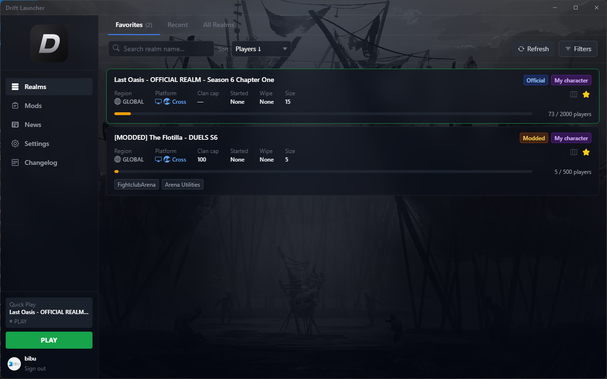
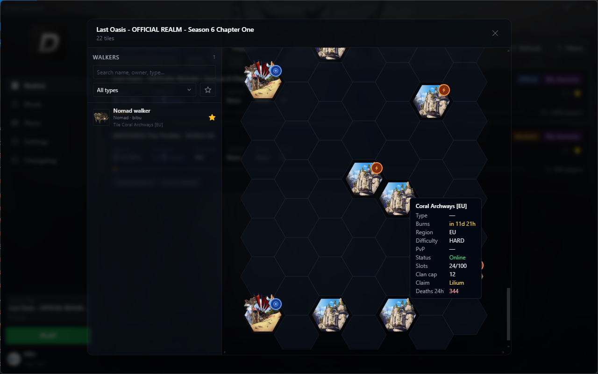
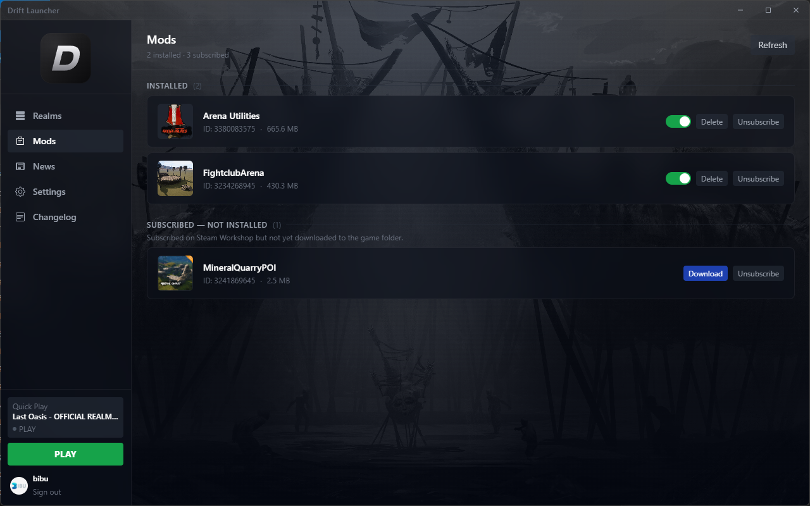
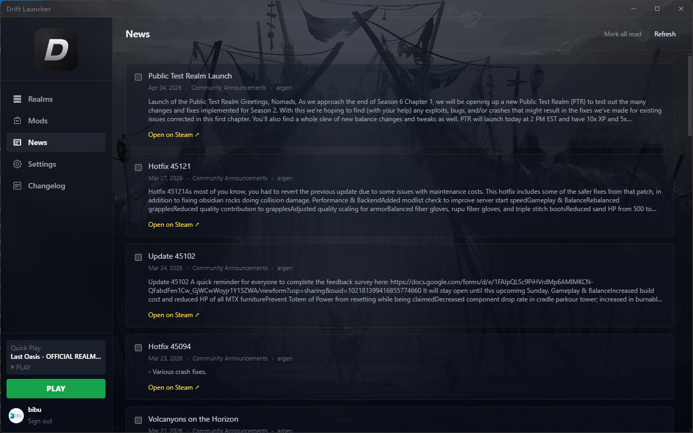
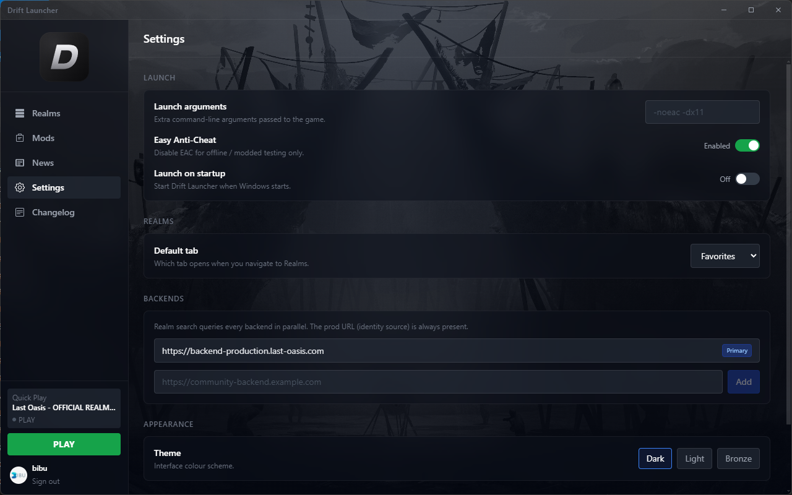
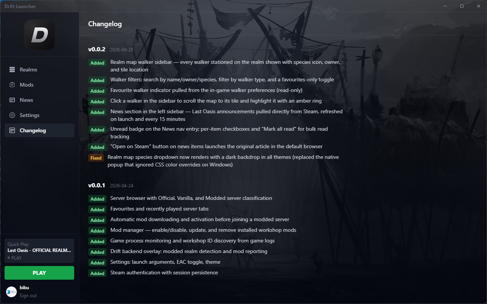

# DriftLauncher

A custom launcher for **Last Oasis** built with Electron, React, and the Steamworks SDK. Browse realms, manage mods, and launch the game — all from one place.


---

## Features

- **Realm Browser** — Search, filter, and sort all available Last Oasis servers. Filter by region, provider, type (vanilla/modded), and player count. Pin a realm as your Quick Play target for one-click launches.
- **Realm map view** — Click any realm to open its hex grid with tile types, claim ownership, online state, and lifecycle timers (spawn / burn / decayed).
- **Walker sidebar** — On the realm map, the left panel lists every walker stationed on the realm with species icon, owner, and tile location. Filter by name, walker type, or favourites only; click a row to scroll the map to its tile and highlight it. The favourite marker is pulled live from your in-game walker preferences.
- **News** — Last Oasis announcements pulled directly from Steam (refreshed on launch and every 15 minutes). Unread badge in the sidebar, per-item or bulk "Mark read", and an Open-on-Steam button that opens the original article in your default browser.
- **Multi-backend support** — Query the official prod backend alongside community-run backends in parallel. Each realm is tagged with its origin so follow-up calls (map, join) route to the right server. Add/remove community URLs under Settings → Backends; the prod URL stays pinned as the primary identity source.
- **Mod Manager** — View installed and subscribed Workshop mods, download updates, enable/disable mods per-session, and subscribe/unsubscribe directly from the launcher.
- **Automatic mod activation** — When joining a modded realm, the launcher automatically downloads missing mods, copies them into the game folder, and sets the correct `active` flags before launching.
- **Steam integration** — Authenticates via Steam, fetches your profile picture, and uses the Steamworks Workshop API for mod state and download management.
- **Quick Play** — Pin any realm and launch the game instantly from the sidebar without navigating back to the browser.
- **Persistent preferences** — Favorites, recent realms, quick-play realm, read-news state, and all settings are saved to disk and restored on next launch.
- **Settings** — Configure launch arguments, EAC toggle, default realm tab, theme, and backend URLs.

---

## Screenshots

| Realms | Realm map + walker sidebar |
|---|---|
|  |  |

| Mods | News |
|---|---|
|  |  |

| Settings | Changelog |
|---|---|
|  |  |

---

## Download

Pre-built Windows binaries are published on the [GitHub Releases](https://github.com/bibu87/DriftLauncherClient/releases/latest) page. Two flavours are provided for each release:

- **`DriftLauncher-<version>-win-x64.exe`** — single-file portable build. Download and run; no installation step.
- **`DriftLauncher-<version>-win-x64.zip`** — zipped unpacked build. Extract anywhere and run `DriftLauncher.exe` from the extracted folder.

Steam must be running when you launch, and Last Oasis (App ID `903950`) must be installed via Steam.

> Builds are currently unsigned, so Windows SmartScreen may warn the first time you run the exe. Click *More info → Run anyway* if you trust the source.

---

## Documentation

Full documentation lives in the [`docs/`](./docs/README.md) folder.

**For users:**
- [Getting Started](./docs/getting-started.md) — Install, run, first launch, where data is stored.
- [Realm Browser & Map](./docs/realms.md) — Browsing servers, the hex map view, walker sidebar.
- [Mod Manager](./docs/mods.md) — Workshop integration, automatic activation, EAC notes.
- [News](./docs/news.md) — Steam news feed and read tracking.
- [Settings & Data Storage](./docs/settings.md) — Preferences, themes, backends, on-disk files.

**For developers:**
- [Architecture](./docs/architecture.md) — Project layout, processes, data flow.
- [Authentication](./docs/authentication.md) — Steam ticket → Last Oasis session pipeline.
- [Backends](./docs/backends.md) — Multi-backend support and the Drift mod-consensus service.
- [IPC Reference](./docs/ipc-reference.md) — Every renderer↔main IPC channel.
- [Build & Release](./docs/build-and-release.md) — Dev workflow and packaging Windows builds.

---

## Project Structure

```
DriftLauncherClient/
├── apps/
│   └── launcher/          # Electron app (main + renderer)
│       ├── src/main/      # Main process: game launch, mods, Steam IPC handlers
│       ├── src/preload/   # Context bridge / IPC surface
│       └── src/renderer/  # React UI (pages, store, layouts)
└── packages/
    ├── shared/            # Shared TypeScript types
    └── lo-protos/         # Last Oasis protobuf schemas
```

The **Drift backend** (realm-mod consensus service at `drift.nexteam.net`) is a separate proprietary service; its source is not included in this repository. The launcher talks to it over a small HTTP API (`GET /realms`, `POST /realms/:id/mods`), so third parties can run their own compatible backend by pointing `DRIFT_BACKEND_URL` at their service.

---

## Tech Stack

| Layer | Technology |
|---|---|
| Desktop shell | Electron 30 |
| Build tool | electron-vite |
| UI | React 18, React Router, Tailwind CSS |
| State | Zustand |
| Steam | steamworks.js (Greenworks-style native bindings) |
| Language | TypeScript throughout |
| Package manager | pnpm workspaces |

---

## Getting Started

### Prerequisites

- Node.js 20+
- pnpm 9+
- Steam running (required for Steamworks SDK initialisation)
- Last Oasis installed via Steam (App ID `903950`)

### Install

```bash
pnpm install
```

### Development

```bash
# Launcher (Electron + Vite dev server)
pnpm --filter launcher dev
```

### Build

```bash
# Compile main / preload / renderer bundles into out/
pnpm --filter launcher build

# Regenerate resources/icon.ico from drift_launcher.svg (after editing the SVG)
pnpm --filter launcher icon

# Package a portable Windows exe into apps/launcher/dist/
pnpm --filter launcher dist
```

---

## How Mods Work

Last Oasis loads mods from:

```
Steam\steamapps\common\Last Oasis\Mist\Content\Mods\<workshopId>\
```

Each mod folder contains a `modinfo.json` with an `"active"` boolean. The launcher:

1. Checks which mods a realm requires against what's installed in the game folder.
2. Downloads any missing mods via the Steam Workshop API.
3. Copies mod folders from the Steam workshop cache into the game mods directory if needed.
4. Sets `"active": true` for required mods and `"active": false` for all others before launch.

Official and vanilla servers always launch with all mods deactivated.

---

## License

Licensed under the [GNU General Public License v3.0 or later](./LICENSE).

You are free to use, modify, and redistribute this code, provided that any distributed derivative works are also released under the GPL and that their source code is made available. See the [LICENSE](./LICENSE) file for the full terms.

This project is not affiliated with Donkey Crew or Last Oasis; "Last Oasis" remains a trademark of its respective owner.
